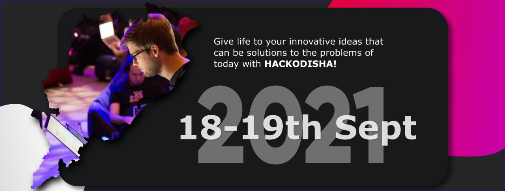

<p align='center'></p>

<h1 align='center'> HackOdisha </h1>

<p align='center'>Hackodisha brings an enterprising platform where hackers can showcase their unique ideas and expand boundaries with their creativity and proficiency. Webwiz, the technical club of NIT Rourkela is proud to host the hackathon on the eve of the diamond jubilee celebration of NIT Rourkela and strives to make it exciting, edifying, and educational. We will also be having many Pre-hack events for around a month where multiple communities will be organizing workshops and competitions. In this 36 hours </p>



[](https://github.com/zepfietje/starware)

Hackodisha-web is Starware.  
This means you're free to use the project, as long as you star its GitHub repository.  
Your appreciation makes us grow and glow up. 
The license of this repository has changed from `MIT License` to `GNU AGPLv3`. ⭐

#### [Development](https://hackodisha.web.app/)


# Prerequisites 👨‍💻

### Install Node JS
Refer to https://nodejs.org/en/ to install nodejs

### Install create-react-app
Install create-react-app npm package globally. This will help to easily run the project and also build the source files easily. Use the following command to install create-react-app

```bash
npm install -g create-react-app
```

## Cloning and Running the Application in local 💻

Clone the project in localhost
```bash
git clone https://github.com/Hackodisha/hackodisha-web.git
```
Install all the npm packages. Go into the project folder and type the following command to install all npm packages

```bash
npm install
```

In order to run the application Type the following command

```bash
npm start
```

The Application Runs on **localhost:3000**


`Contributions are welcome 🎉🎉`

# Ways to contribute:
1. Solve the issues which are listed
2. Create your own issue and then send PR.

Please refer to the project's style and contribution guidelines for submitting patches and additions. In general, we follow the "fork-and-pull" Git workflow.

 1. **Fork** the repo on GitHub
 2. **Clone** the project to your own machine
 3. **Commit** changes to your own branch
 4. **Push** your work back up to your fork
 5. Submit a **Pull request** so that we can review your changes
 6. So, feel free to fork this repo. If you do, please just give us proper credit by linking back to our website, https://hackodisha.xyz/.

### Please abide by  [Contributing Guidelines](https://github.com/Hackodisha/hackodisha-web/blob/main/CONTRIBUTING.md) and [Code of Conduct](https://github.com/Hackodisha/hackodisha-web/blob/main/CODE_OF_CONDUCT.md) 🚀

## Contributors ✨

Thanks goes to these wonderful people ([emoji key](https://allcontributors.org/docs/en/emoji-key)):

<!-- ALL-CONTRIBUTORS-LIST:START - Do not remove or modify this section -->
<!-- prettier-ignore-start -->
<!-- markdownlint-disable -->
<table>
  <tr>
    <td align="center"><a href="http://bartek532.github.io/portfolio"><br /><sub><b>Bartosz Zagrodzki</b></sub></a><br /><a href="#a11y-Bartek532" title="Accessibility">️️️️♿️</a> <a href="https://github.com/Hackodisha/hackodisha-web/issues?q=author%3ABartek532" title="Bug reports">🐛</a> <a href="https://github.com/Hackodisha/hackodisha-web/commits?author=Bartek532" title="Code">💻</a> <a href="#ideas-Bartek532" title="Ideas, Planning, & Feedback">🤔</a> <a href="https://github.com/Hackodisha/hackodisha-web/pulls?q=is%3Apr+reviewed-by%3ABartek532" title="Reviewed Pull Requests">👀</a></td>
    <td align="center"><a href="https://aniket.live"><br /><sub><b>Aniket Pal</b></sub></a><br /><a href="#maintenance-Aniket762" title="Maintenance">🚧</a> <a href="#mentoring-Aniket762" title="Mentoring">🧑‍🏫</a> <a href="#projectManagement-Aniket762" title="Project Management">📆</a> <a href="https://github.com/Hackodisha/hackodisha-web/commits?author=Aniket762" title="Documentation">📖</a> <a href="https://github.com/Hackodisha/hackodisha-web/commits?author=Aniket762" title="Code">💻</a> <a href="#content-Aniket762" title="Content">🖋</a></td>
    <td align="center"><a href="https://github.com/Sonakshi1901"><br /><sub><b>Sonakshi Satpathy</b></sub></a><br /><a href="https://github.com/Hackodisha/hackodisha-web/commits?author=Sonakshi1901" title="Code">💻</a> <a href="https://github.com/Hackodisha/hackodisha-web/issues?q=author%3ASonakshi1901" title="Bug reports">🐛</a> <a href="#ideas-Sonakshi1901" title="Ideas, Planning, & Feedback">🤔</a></td>
    <td align="center"><a href="https://sumana.live/"><br /><sub><b>Sumana Basu</b></sub></a><br /><a href="https://github.com/Hackodisha/hackodisha-web/commits?author=sumana2001" title="Code">💻</a> <a href="https://github.com/Hackodisha/hackodisha-web/issues?q=author%3Asumana2001" title="Bug reports">🐛</a> <a href="#ideas-sumana2001" title="Ideas, Planning, & Feedback">🤔</a></td>
  </tr>
</table>

<!-- markdownlint-restore -->
<!-- prettier-ignore-end -->

<!-- ALL-CONTRIBUTORS-LIST:END -->

This project follows the [all-contributors](https://github.com/all-contributors/all-contributors) specification. Contributions of any kind welcome!
